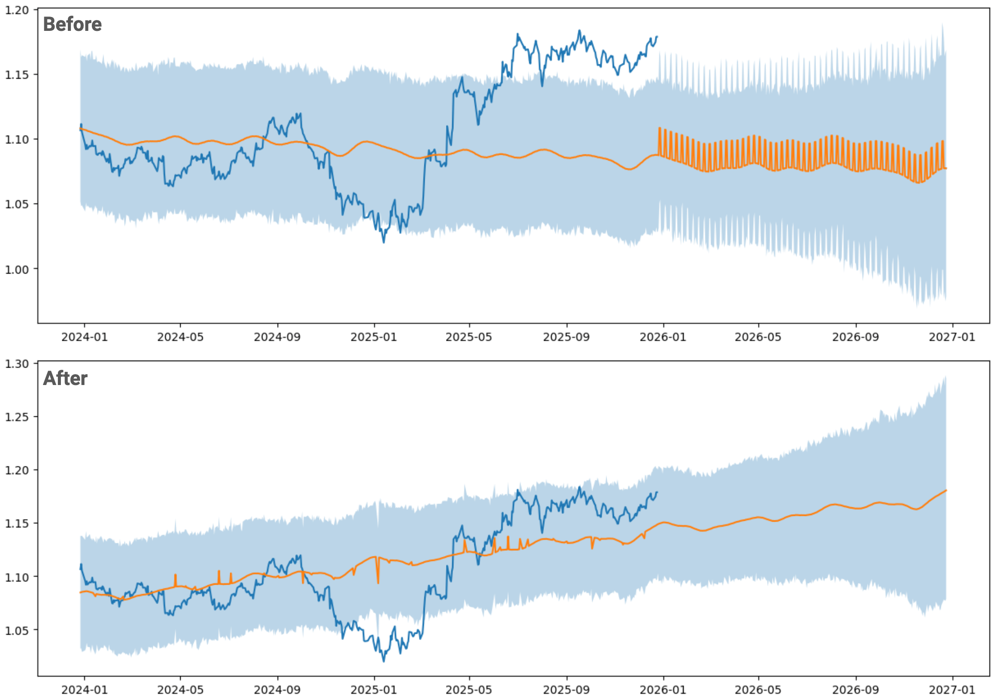

## 👨‍💻 mlflow-prophet-labs
This project uses [Prophet](https://facebook.github.io/prophet/) for time series forecasting and [MLflow](https://mlflow.org/) for experiment tracking to predict USD/EUR exchange rates one year ahead. DDataset sourced from the [European Central Bank Date Portal](https://data.ecb.europa.eu/)

### 🔧 Tuning
While most hyperparameters are tuned automatically with Optuna, requiring little manual intervention, a hands-on approach was taken for the `changepoint_range`. 

The following pictures shows that a value of 0.95 began to worsen key metrics, 


while 0.9 proved to be the sweet spot for better accuracy. 


Visual comparisons were made in the MLflow UI.

### 📊 Results  
This comparision illustrate the difference between the default automatic predictions and the outcomes after [tuning](#tuning).

> [!CAUTION] 
This is in no way a professional financial forecast. Use it at your own decretion



### Useful commands

```
docker compose -f compose.infra.yml -p mlflow-prothet up -d  
```

```
poetry run jupyter notebook
```

```
poetry run jupyter lab
```

```
poetry run mlflow server --backend-store-uri <connection-string> --port 8000
```